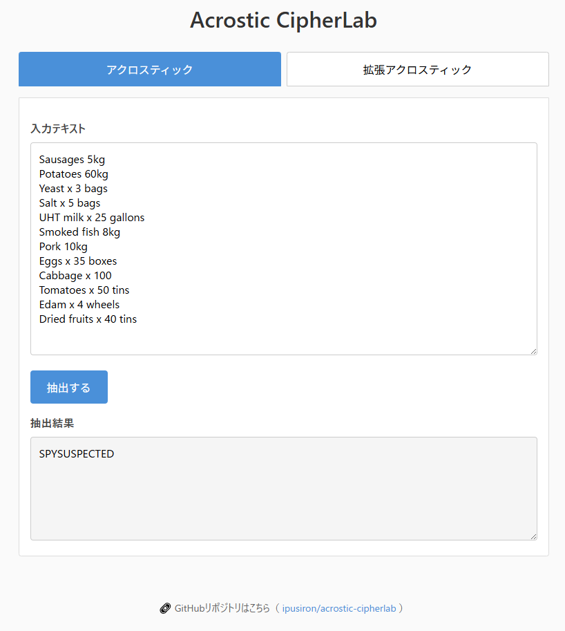

<!--
---
id: day103
slug: acrostic-cipherlab

title: "Acrostic CipherLab"

subtitle_ja: "アクロスティック解読ツール"
subtitle_en: "Laboratory for Acrostic & Positional Extraction"

description_ja: "行頭文字や任意位置を抽出して隠れメッセージを可視化するアクロスティック解読ツール。"
description_en: "An educational tool for extracting acrostics and positional characters to reveal hidden messages."

category_ja:
  - 古典暗号
  - テキスト解析

category_en:
  - Classical Cryptography
  - Text Analysis

difficulty: 1

tags:
  - acrostic
  - cipher
  - text-processing
  - javascript
  - hidden-message

repo_url: "https://github.com/ipusiron/acrostic-cipherlab"
demo_url: "https://ipusiron.github.io/acrostic-cipherlab/"

hub: true
---
-->

# Acrostic CipherLab – アクロスティック解読ツール


[](https://ipusiron.github.io/acrostic-cipherlab/)

**Day103 - 生成AIで作るセキュリティツール200**

Acrostic CipherLabは、複数行テキストから特定位置の文字を抽出し、隠されたメッセージ（アクロスティック）を可視化する教育向けツールです。

行頭文字の抽出だけでなく、行末からの位置指定や記号を基準とした抽出にも対応しており、CTFや暗号解読の学習に活用できます。

---

## 🌐 デモページ

👉 **[https://ipusiron.github.io/acrostic-cipherlab/](https://ipusiron.github.io/acrostic-cipherlab/)**

ブラウザーで直接お試しいただけます。

---

## 📸 スクリーンショット

> 
>
> *CypherのSTEGANOGRAPHY PUZZLE 01を解読*

---

## 🔬 アクロスティックとは

**アクロスティック（Acrostic）** とは、詩や文章の各行の先頭文字（または特定位置の文字）を縦に読むと、別の単語やメッセージが浮かび上がる技法です。
古代ギリシャ・ローマ時代から用いられ、文学的表現や秘密通信の手段として活用されてきました。

暗号学の観点では、アクロスティックは**分置式暗号（Transposition Cipher）の位置抽出型**の一種に分類されます。
分置式暗号は文字の並び替えによって秘匿を行う方式であり、アクロスティックはその中でも「特定位置の文字を抽出して秘密メッセージを構成する」手法に該当します。

なお、分置式暗号については以下も参考になります。

- [Hidden Message Challenge - 分置式暗号文解読チャレンジツール（Day036）](https://github.com/ipusiron/hidden-message-challenge)

### アクロスティックの例

```
あしたは晴れるかな
いつもの道を歩く
しずかな朝の空気
てんきがいいといいな
```

各行の先頭文字を抽出すると「**あいして**」というメッセージが現れます。

---

## ✨ 機能一覧

本ツールは2つのタブで構成されています。

### アクロスティック（基本機能）

各行の**行頭1文字**を抽出して連結する基本的なアクロスティック解読機能です。

- 入力テキストを行ごとに分割
- 各行の先頭1文字を取得して連結
- 空行はスキップ

### 拡張アクロスティック（応用機能）

より柔軟な位置指定による文字抽出が可能です。

| モード | 説明 |
|--------|------|
| 行頭から n 文字目 | 各行の先頭から n 番目の文字を抽出 |
| 行末から前に n 文字目 | 各行の末尾から n 番目の文字を抽出 |
| カンマ・ピリオド前の n 文字目 | 最初に見つかった `,` または `.` の n 文字前を抽出 |

---

## 📖 使い方

1. タブを選択（「アクロスティック」または「拡張アクロスティック」）
2. テキストエリアに複数行のテキストを入力
3. 拡張タブの場合は、抽出モードとnの値を設定
4. 「抽出する」ボタンをクリック
5. 結果が出力欄に表示される

### 使用例

**入力テキスト：**
```
あいうえお
かきくけこ
さしすせそ
```

**基本タブの結果：** `あかさ`（各行の1文字目）

**拡張タブ（行頭から2文字目）の結果：** `いきし`

---

## 🎯 ユースケース

### ワードサーチ（縦読み）

本ツールは、ワードサーチパズルで縦方向に隠された単語を探す用途にも利用できます。
「行頭からn文字目」モードでnを指定すれば、グリッドの任意の列を縦に読み取ることが可能です。

```
CATXYZ
OPQRST
DEABCD
EFGHIJ
```

上記で「行頭から1文字目」を抽出すると `CODE` が得られます。

### CTF（Capture The Flag）

CTF競技のステガノグラフィー問題やミスク問題では、テキストに隠されたフラグを探す場面があります。
本ツールを使えば、各行の特定位置から文字を素早く抽出し、隠しメッセージの有無を確認できます。

### 縦読みネタの検出

SNSや掲示板では、一見普通の文章に見せかけて各行の先頭文字で別のメッセージを伝える「縦読み」がしばしば用いられます。
本ツールで行頭文字を抽出すれば、そうした隠しメッセージを簡単に発見できます。

---

## 📁 ディレクトリー構造

```
acrostic-cipherlab/
├── index.html          # メインHTMLファイル
├── script.js           # JavaScriptコード
├── style.css           # スタイルシート
├── README.md           # 本ドキュメント
├── CLAUDE.md           # Claude Code用ガイド
├── LICENSE             # MITライセンス
├── .gitignore          # Git除外設定
├── .nojekyll           # GitHub Pages設定
└── assets/             # 画像リソース
    └── screenshot.png  # スクリーンショット
```

---

## 📄 ライセンス

- ソースコードのライセンスは `LICENSE` ファイルを参照してください。

---

## 🛠️ このツールについて

本ツールは、「生成AIで作るセキュリティツール200」プロジェクトの一環として開発されました。
このプロジェクトでは、AIの支援を活用しながら、セキュリティに関連するさまざまなツールを100日間にわたり制作・公開していく取り組みを行っています。

プロジェクトの詳細や他のツールについては、以下のページをご覧ください。

🔗 [https://akademeia.info/?page_id=44607](https://akademeia.info/?page_id=44607)
